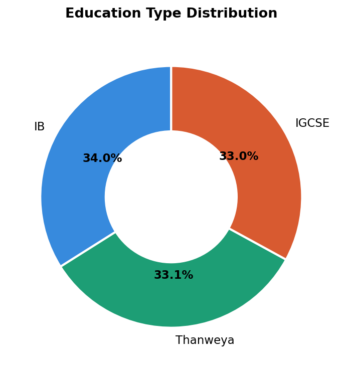
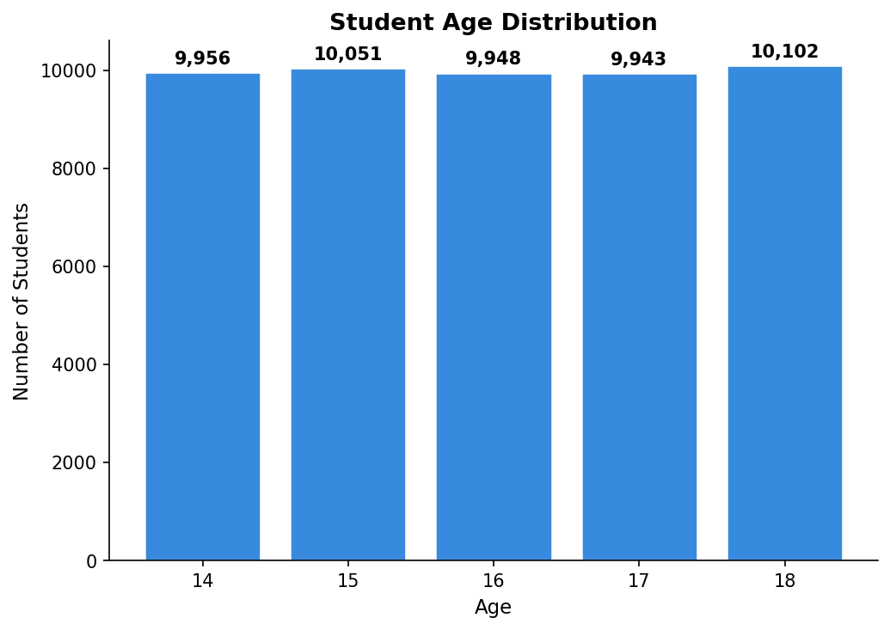
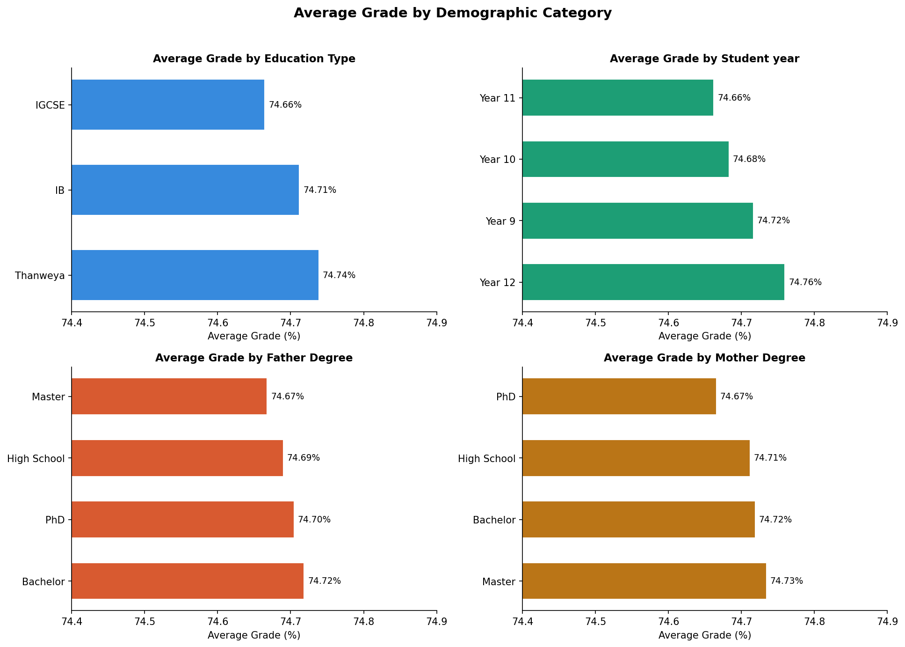
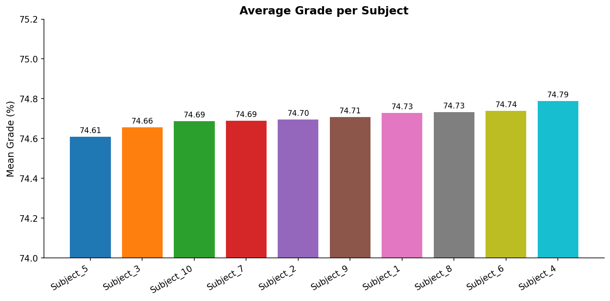
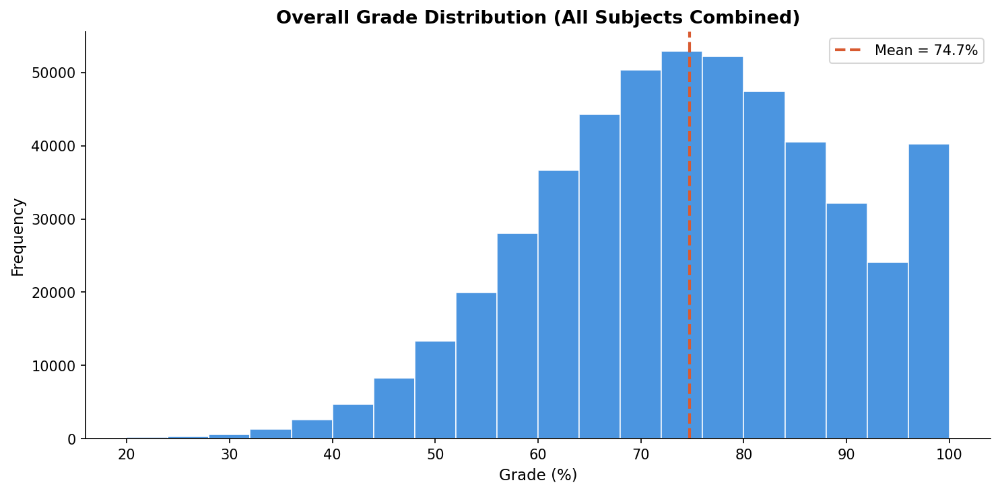
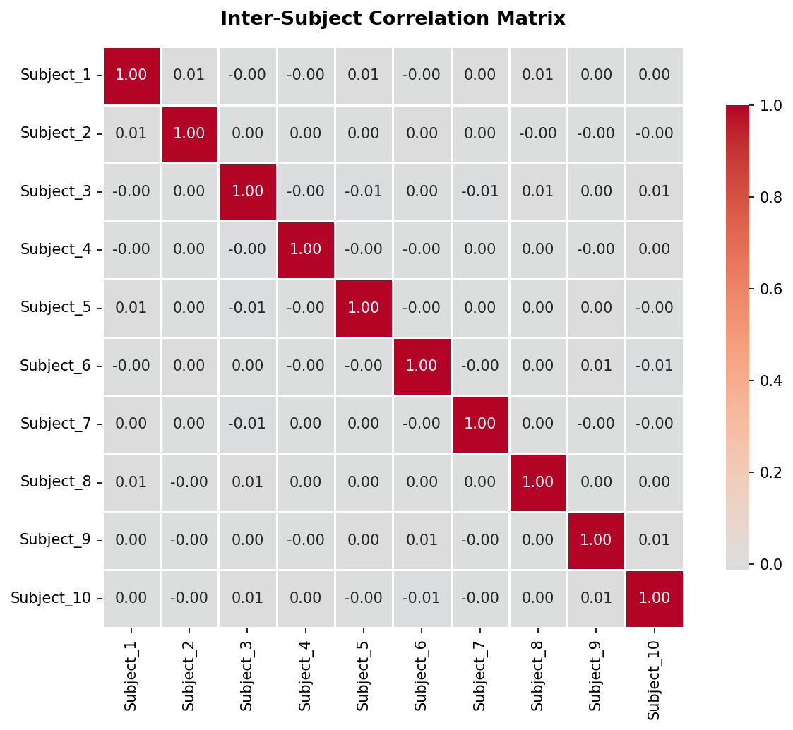

# Education in Egypt — Exploratory Data Analysis Project

<div>

| | |
|---|---|
| **Student** | Ahmed Shehata Said Abdelwahed |
| **Academic Year** | 3rd Year |
| **Course** | Data Analysis |
| **Date** | April 2026 |

</div>

---

## Project Overview

This project performs a comprehensive **Exploratory Data Analysis (EDA)** on the
[Education in Egypt](https://www.kaggle.com/datasets/mohamedalabasy/education-in-egypt)
dataset published on Kaggle. The analysis examines academic performance of 50,000
Egyptian students across three education systems (Thanweya, IGCSE, IB), exploring
the relationship between student demographics, parental education levels, and
academic grades across 10 subjects.

---

## Dataset Description

- **Source:** [Kaggle — Education in Egypt](https://www.kaggle.com/datasets/mohamedalabasy/education-in-egypt)
- **Author:** Mohamed Alabasy
- **Size:** 50,000 rows × 16 columns

### Columns

| # | Column | Type | Description |
|---|--------|------|-------------|
| 1 | Student Name | String | Full name of the student |
| 2 | Student Age | Integer | Age (14–18) |
| 3 | Student year | String | School year (Year 9–12) |
| 4 | Father Degree | String | Father's education level (High School / Bachelor / Master / PhD) |
| 5 | Mother Degree | String | Mother's education level (High School / Bachelor / Master / PhD) |
| 6 | Education Type | String | Education system (Thanweya / IGCSE / IB) |
| 7–16 | Subject_1 to Subject_10 | Float | Grade (%) in each of the 10 subjects |

### Missing Values

| Column | Missing Count | Percentage |
|--------|:------------:|:----------:|
| Father Degree | 10,040 | 20.1% |
| Mother Degree | 10,090 | 20.2% |
| All other columns | 0 | 0% |

---

## Project Structure

```
Education in Egypt/
│
├── README.md              # Project documentation (this file)
├── eda.py                 # Main EDA Python script
├── requirements.txt       # Python dependencies
│
├── data/
│   └── dataset.csv        # Raw dataset (50,000 rows)
│
└── plots/                 # Generated visualizations
    ├── plot_edu_type.png       # Education type distribution
    ├── plot_age_dist.png       # Student age distribution
    ├── plot_avg_by_category.png # Avg grade by demographic
    ├── plot_subject_avgs.png   # Per-subject averages
    ├── plot_grade_dist.png     # Overall grade histogram
    └── plot_corr_heatmap.png   # Inter-subject correlation
```

---

## Libraries Used

| Library | Version | Purpose |
|---------|---------|---------|
| **pandas** | >= 2.0 | Data loading, manipulation, grouping, and aggregation |
| **numpy** | >= 1.24 | Numerical computations, array operations |
| **matplotlib** | >= 3.7 | Chart creation (bar, pie/donut, histogram) |
| **seaborn** | >= 0.13 | Statistical visualization (correlation heatmap) |

---

## How to Run

```bash
# 1. Install Python dependencies
pip install -r requirements.txt

# 2. Run the analysis
python eda.py
```

The script will:
- Print all statistics and findings to the console
- Save 6 plots as PNG files in the `plots/` directory

---

## Analysis Steps

The EDA follows 10 sequential steps, each clearly labeled in the script:

### Step 1 — Load & Inspect the Dataset
Load `dataset.csv` using pandas and inspect its shape (50,000 × 16), data types,
and missing values. This step confirms 20% missing parental degree data.

### Step 2 — Descriptive Statistics
Generate summary statistics (`describe()`) for all numerical columns and frequency
counts for each categorical variable (Education Type, Father/Mother Degree, Student Year, Age).

### Step 3 — Feature Engineering
Create a new computed column `avg_grade` — the mean score across all 10 subjects
for each student. This derived feature simplifies downstream comparisons.

### Step 4 — Education Type Distribution (Donut Chart)
Visualize the distribution of the three education systems. All three are nearly
equally represented: IB (34.0%), Thanweya (33.1%), IGCSE (33.0%).

### Step 5 — Student Age Distribution (Bar Chart)
Plot the count of students per age group (14–18). The distribution is uniform,
with approximately 10,000 students per age.

### Step 6 — Average Grade by Demographic Category (2×2 Bar Chart)
Compare average grades across four groupings in a single figure:
- Education Type
- Student Year
- Father's Degree
- Mother's Degree

### Step 7 — Per-Subject Average Grades (Bar Chart)
Compare the mean grade across all 10 subjects to identify any subject-level
variations. All subjects cluster within the 74.6–74.8% range.

### Step 8 — Overall Grade Distribution (Histogram)
Flatten all 500,000 individual grades into a single histogram to visualize the
overall grade distribution, with a mean reference line at 74.7%.

### Step 9 — Inter-Subject Correlation Heatmap
Compute and visualize the Pearson correlation matrix between all 10 subjects.
Maximum off-diagonal correlation is 0.0123, indicating near-zero correlation.

### Step 10 — Key Findings Summary
Print a consolidated summary of all key metrics and findings.

---

## Visualizations & Results

### 1. Education Type Distribution

Three education tracks are nearly evenly split:

| Type | Count | Share |
|------|-------|-------|
| IB | 16,977 | 34.0% |
| Thanweya | 16,545 | 33.1% |
| IGCSE | 16,478 | 33.0% |

<div align="center">

</div>

### 2. Student Age Distribution

Ages 14–18 are uniformly distributed (~10,000 students per age).

<div align="center">

</div>

### 3. Average Grade by Demographic Category

All four demographic breakdowns (Education Type, School Year, Father Degree, Mother Degree) show remarkably tight mean grades in the **74.4–74.9%** band — differences are < 0.1 percentage points.

| Education Type | Avg Grade |
|---------------|-----------|
| Thanweya | 74.74% |
| IB | 74.71% |
| IGCSE | 74.66% |

| Father Degree | Avg Grade |
|--------------|-----------|
| Bachelor | 74.72% |
| PhD | 74.70% |
| High School | 74.69% |
| Master | 74.67% |

| Mother Degree | Avg Grade |
|--------------|-----------|
| Master | 74.74% |
| Bachelor | 74.73% |
| High School | 74.73% |
| PhD | 74.66% |

<div align="center">

</div>

> [!IMPORTANT]
> Parental education level has essentially **no measurable effect** on student grades in this dataset. The same holds for education type and year.

### 4. Average Grade per Subject

All 10 subjects cluster within a narrow **74.6–74.8%** band. Subject_4 is the highest (74.79%), Subject_5 is the lowest (74.61%).

<div align="center">

</div>

### 5. Overall Grade Distribution

The distribution is **left-skewed** with a peak around 75%, a hard floor at 20%, and a hard ceiling at 100%. The bulk of grades fall in the 55–95% range.

<div align="center">

</div>

### 6. Inter-Subject Correlation Matrix

All off-diagonal correlations are essentially **zero** (max |r| = 0.0123). Subjects are statistically independent of each other.

<div align="center">

</div>

### Key Statistics Summary

| Metric | Value |
|--------|-------|
| **Overall mean grade** | 74.71% |
| **Overall std grade** | 14.36% |
| **Grade range** | 20 – 100% |
| **Max inter-subject correlation (off-diag)** | 0.0123 |
| **Missing — Father Degree** | 10,040 (20.1%) |
| **Missing — Mother Degree** | 10,090 (20.2%) |

---

## Key Findings

| # | Finding |
|---|---------|
| 1 | **50,000 students** across 3 education types — evenly distributed (~33% each) |
| 2 | **Ages 14–18** — uniformly distributed (~10,000 per age group) |
| 3 | **~20% missing** parental education data (symmetric for both parents) |
| 4 | **Overall mean grade: 74.71%**, standard deviation: 14.36%, range: 20–100% |
| 5 | **No significant demographic effects** — education type, year, and parental degrees have negligible impact on average grade (< 0.1 percentage point differences) |
| 6 | **All subjects perform similarly** — mean grades range from 74.61% to 74.79% |
| 7 | **Subjects are statistically independent** — maximum inter-subject correlation is 0.0123 |
| 8 | **Grade distribution is left-skewed** — peak around 75% with hard boundaries at 20% and 100% |

---

<div align="center">

**Ahmed Shehata Said Abdelwahed** — Data Analysis Course — 3rd Year

Dataset: [Education in Egypt (Kaggle)](https://www.kaggle.com/datasets/mohamedalabasy/education-in-egypt)

</div>
